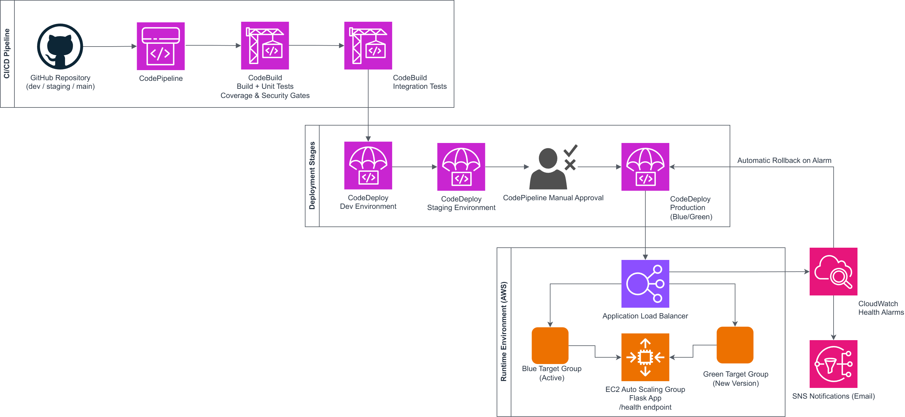

# Automated CI/CD Pipeline with Multi-Environment Deployment

This project implements a **fully automated CI/CD pipeline** for a Python web application using **AWS CodePipeline, CodeBuild, and CodeDeploy**, supporting deployments across **development, staging, and production** environments.

The pipeline demonstrates real-world DevOps practices including automated testing, security scanning, Blue/Green deployments, and automatic rollback based on application health.

---

## Table of Contents

* [Project Overview](#project-overview)
* [Repository Structure](#repository-structure)
* [Branching Strategy](#branching-strategy)
* [Architecture Overview](#architecture-overview)
* [CI/CD Pipeline Workflow](#cicd-pipeline-workflow)
* [Quality Gates](#quality-gates)
* [Monitoring and Rollback](#monitoring-and-rollback)
* [Setup Instructions](#setup-instructions)
* [Troubleshooting](#troubleshooting)

---

## Project Overview

This project demonstrates a production-style CI/CD pipeline with the following capabilities:

* Multi-environment deployment (dev, staging, prod)
* Automated unit and integration testing
* Security scanning and quality gates
* Blue/Green deployments using AWS CodeDeploy
* Automatic rollback using CloudWatch alarms
* Infrastructure provisioning using Terraform
* Notifications using Amazon SNS

The goal is to show how application delivery can be automated end-to-end while maintaining safety, visibility, and control.

---

## Repository Structure

```
automated-cicd-multi-env/
├── app/                     # Application source code
│   ├── app.py               # Flask application
│   └── requirements.txt     # Python dependencies
├── cicd/                    # CI/CD configuration
│   ├── appspecs/
│   │   └── appspec.yml      # CodeDeploy lifecycle definition
│   ├── buildspecs/
│   │   ├── buildspec.yml    # Build + unit tests + security scans
│   │   └── test_buildspec.yml # Integration tests
│   └── scripts/             # Deployment and validation scripts
├── infra/                   # Terraform infrastructure code
│   ├── modules/
│   │   ├── alb/             # Application Load Balancer
│   │   ├── codebuild/       # CodeBuild projects
│   │   ├── codedeploy/      # Blue/Green deployment groups + alarms
│   │   ├── iam/             # IAM roles and policies
│   │   ├── monitoring/      # Monitoring resources (minimal)
│   │   ├── pipeline/        # CodePipeline definition
│   │   └── security/        # AWS Inspector configuration
│   └── main.tf              # Root Terraform configuration
├── tests/
│   ├── test_app.py          # Unit tests
│   └── integration/
│       └── test_integration.py # Integration tests
└── docs/
    ├── BRANCHING_STRATEGY.md
    └── QUALITY_GATES.md
```

---

## Branching Strategy

This repository uses a **three-branch strategy** aligned with deployment environments:

* **`dev`** – Development environment

  * Active development branch
  * Pipeline source stage is triggered from this branch

* **`staging`** – Staging / pre-production

  * Changes promoted via pull request from `dev`

* **`main`** – Production

  * Changes promoted via pull request from `staging`

Branch protection rules are documented and enforce pull-request-based promotion for staging and production.

See [`docs/BRANCHING_STRATEGY.md`](docs/BRANCHING_STRATEGY.md) for full details.

---

## Architecture Overview

The following diagram illustrates the complete CI/CD and runtime architecture used in this project.



### High-Level Flow

```
GitHub (dev branch)
        ↓
AWS CodePipeline
        ↓
CodeBuild (Build + Unit Tests + Security Scans)
        ↓
CodeBuild (Integration Tests)
        ↓
CodeDeploy (Dev)
        ↓
CodeDeploy (Staging)
        ↓
Manual Approval
        ↓
CodeDeploy (Production – Blue/Green)
```

### Deployment Architecture

* EC2 instances are managed via Auto Scaling Groups
* Application traffic is routed through an Application Load Balancer
* Blue/Green deployments are handled by CodeDeploy
* Health is validated via `/health` endpoint
* CloudWatch alarms monitor ALB target group health

---

## CI/CD Pipeline Workflow

### 1. Source Stage

* CodePipeline pulls source code from GitHub using CodeStar Connections
* Triggered on changes to the `dev` branch

---

### 2. Build Stage (CodeBuild)

Executed using `buildspec.yml`:

* Install dependencies
* Run unit tests
* Enforce **minimum 80% code coverage**
* Run security scans:

  * Bandit (static code analysis)
  * Safety (dependency vulnerabilities)
  * AWS Inspector (where enabled)
* Package application and deployment artifacts

**Pipeline fails immediately if any quality gate fails.**

---

### 3. Test Stage (CodeBuild – Isolated)

Executed using `test_buildspec.yml`:

* Start application from packaged artifact
* Run integration tests against live HTTP endpoints
* Validate response time and API correctness

---

### 4. Deploy Stage (CodeDeploy)

Deployments are performed using **Blue/Green strategy**:

* New version deployed to green environment
* Application validated before traffic switch
* Traffic switched to green after validation
* Blue instances terminated on success

Deployment lifecycle is defined in `appspec.yml`.

---

### 5. Manual Approval

* A manual approval step is required **before production deployment**
* Ensures human review before live release

---

## Quality Gates

Quality gates ensure only safe and verified code is deployed:

* Unit test coverage ≥ 80%
* No HIGH severity Bandit findings
* No known vulnerable dependencies
* All integration tests must pass
* Application health validation during deployment

See `docs/QUALITY_GATES.md` for full details.

---

## Monitoring and Rollback

### Monitoring

* Application health monitored via ALB target group metrics
* Build and pipeline logs available in CloudWatch Logs
* Pipeline and deployment events published to SNS

### Automatic Rollback

CodeDeploy automatically roll back when:

* Application health checks fail
* CloudWatch alarms detect unhealthy targets
* Deployment validation hooks fail

Rollback is handled directly by CodeDeploy.

---

## Setup Instructions

### Prerequisites

* AWS account
* Terraform ≥ 1.5
* AWS CLI configured
* GitHub repository access
* Python 3.12 (for local testing)

---

### Deployment Steps

```bash
git clone https://github.com/<your-username>/automated-cicd-multi-env.git
cd automated-cicd-multi-env

cd infra
terraform init
terraform plan
terraform apply
```
The pipeline will automatically become active after Terraform completes and the CodeStar connection is authorized.

Ensure GitHub repository details and environment variables are correctly set in Terraform variables.

---

## Troubleshooting

### Build Failures

* Check unit test coverage
* Review Bandit or Safety scan output
* Inspect CodeBuild logs

### Deployment Failures

* Check CodeDeploy lifecycle logs on EC2
* Verify `/health` endpoint availability
* Review CloudWatch alarms and target group health

### Rollback Events

* Triggered automatically by CloudWatch alarms
* Can also be triggered by redeploying a previous commit

---

## Summary

This project demonstrates an end-to-end CI/CD pipeline with:

* Automated testing and security enforcement
* Safe Blue/Green deployments
* Automatic rollback on failure
* Infrastructure as Code
* Clear promotion path across environments

It reflects real-world DevOps practices used in enterprise and regulated environments.

---